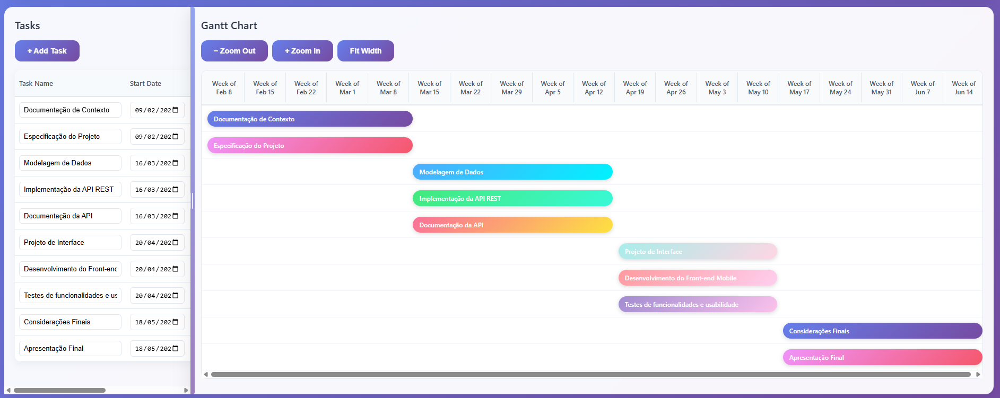
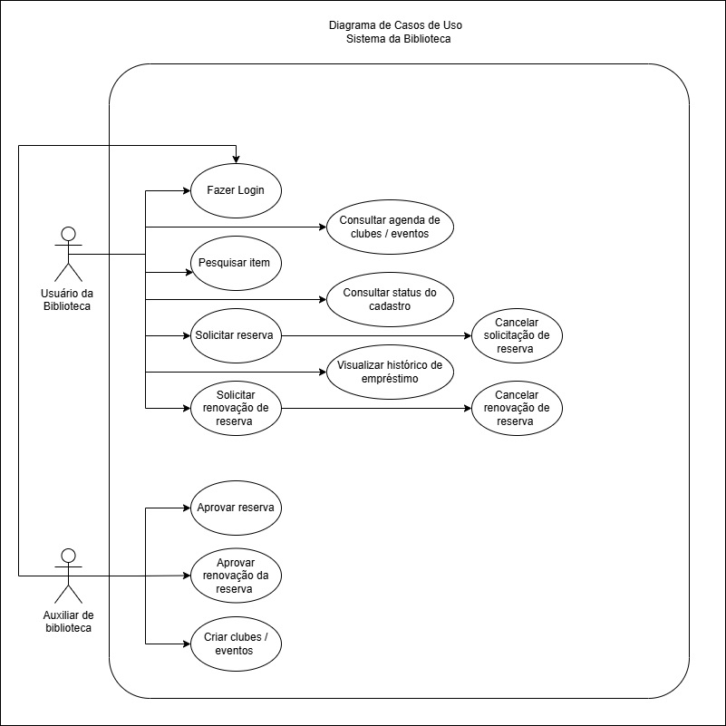
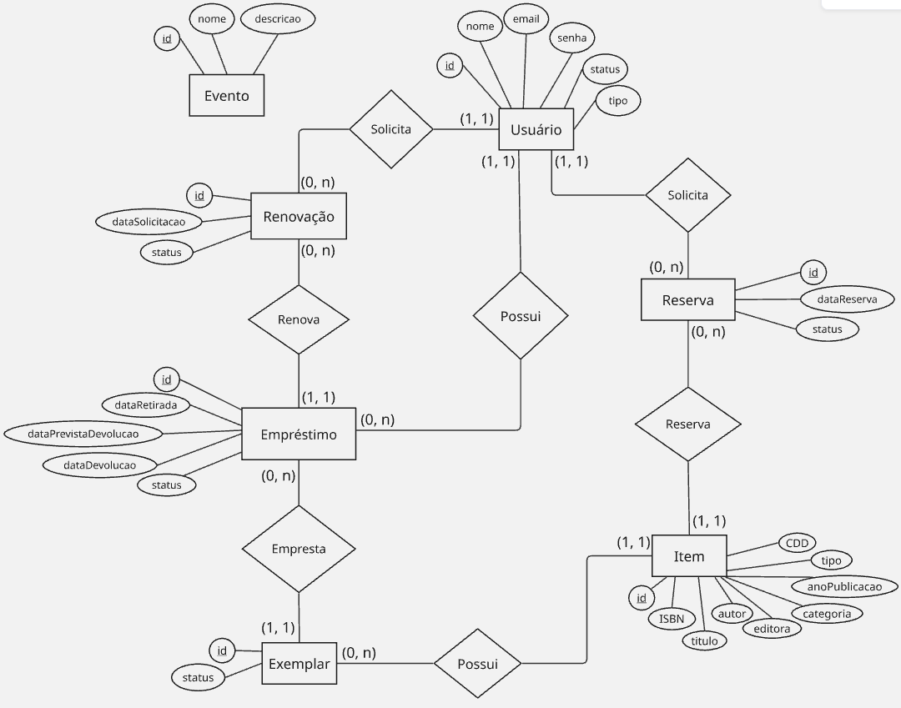

# Especificações do Projeto

Pré-requisitos: <a href="1-Documentação de Contexto.md"> Documentação de Contexto</a>

Através de pesquisas de campo dentro do público alvo do projeto, foram estipuladas as personas que seguem juntamente de suas histórias de usuário, dando origem aos requisitos funcionais e não funcionais da aplicação.

# Personas

# 

# 

# 

# 

# 

## Histórias de Usuários

A partir da compreensão do dia a dia das personas identificadas para o projeto, foram registradas as seguintes histórias de usuários.

| EU COMO... `PERSONA` | QUERO/PRECISO ... `FUNCIONALIDADE` | PARA ... `MOTIVO/VALOR` |
|----------------------|------------------------------------|--------------------------|
| Lucas Ferreira | Pesquisar livros pelo título ou autor no aplicativo da biblioteca. | Saber se a biblioteca possui o livro que estou procurando sem precisar ir até o local. |
| Lucas Ferreira | Ver se um livro está disponível ou emprestado. | Decidir se posso ir até a biblioteca retirar o livro ou se preciso reservá-lo. |
| Lucas Ferreira | Descobrir livros populares ou recomendados. | Encontrar livros que estão em alta nas redes sociais e que eu gostaria de ler. |
| Juliana Martins | Consultar o acervo da biblioteca pelo celular. | Economizar tempo e verificar se existem livros infantis disponíveis para minha filha. |
| Juliana Martins | Reservar livros online antes de ir até a biblioteca. | Ir até a biblioteca apenas para retirar o livro reservado. |
| Juliana Martins | Visualizar livros por categoria infantil. | Encontrar facilmente livros adequados para a idade da minha filha. |
| Aparecida Santos | Receber notificações quando a data de devolução estiver próxima. | Evitar atrasos e multas na devolução dos livros emprestados. |
| Aparecida Santos | Renovar empréstimos diretamente pelo aplicativo. | Não precisar ir até a biblioteca apenas para renovar o prazo do livro. |
| Aparecida Santos | Visualizar os livros que estão atualmente emprestados para mim. | Controlar melhor minhas leituras e datas de devolução. |
| Rafael Oliveira | Consultar os quadrinhos disponíveis na gibiteca da biblioteca. | Saber quais HQs estão disponíveis para leitura ou empréstimo. |
| Rafael Oliveira | Acessar a agenda de clubes e eventos da biblioteca. | Não perder encontros do clube de xadrez, jogos ou outros eventos culturais. |
| Rafael Oliveira | Receber notificações sobre eventos e atividades da biblioteca. | Ser informado sobre novos encontros, campeonatos ou atividades culturais. |
| Camila Rodrigues | Pesquisar livros acadêmicos pelo título ou autor. | Saber se a biblioteca possui os livros indicados pelos professores. |
| Camila Rodrigues | Reservar livros que estejam emprestados. | Garantir que poderei retirar o livro quando ele for devolvido. |
| Camila Rodrigues | Receber uma notificação quando o livro reservado estiver disponível. | Ir até a biblioteca no momento certo para retirar o livro. |

## Arquitetura e Tecnologias

O projeto será desenvolvido utilizando a arquitetura no modelo cliente-servidor, organizada em camadas, com separação entre frontend, backend e banco de dados.

As tecnologias que serão utilizadas no desenvolvimento da aplicação são:

* Backend: ASP.NET Core
  
O backend será responsável por fornecer uma Web API RESTful. A escolha do .NET se dá por sua robustez, performance, segurança e suporte contínuo da Microsoft, sendo amplamente adotado em projetos de pequeno a grande porte.

* Frontend: React Native

O frontend será responsável por fornecer uma interface moderna e responsiva. A escolha do React Native se dá por permitir o desenvolvimento de aplicativos móveis multiplataforma a partir de uma única base de código, reduzindo esforço de desenvolvimento e manutenção.

* Banco de dados: MySQL
  
O banco de dados será responsável por armazenar e consultar os dados recebidos e gerados pelo sistema. A escolha do MySQL se dá por ser um sistema de gerenciamento de banco de dados relacional confiável, amplamente utilizado e pela facilidade de integração com diferentes tecnologias de backend, como o ASP.NET Core utilizado no projeto.

## Diagrama de Contêiner

 

## Requisitos

As tabelas que se seguem apresentam os requisitos funcionais e não funcionais que detalham o escopo do projeto. Para determinar a prioridade de requisitos, aplicar uma técnica de priorização de requisitos e detalhar como a técnica foi aplicada.

### Requisitos Funcionais

|ID    | Descrição do Requisito  | Prioridade |
|------|-----------------------------------------|----|
|RF-001| O sistema deve permitir que o usuário faça login | ALTA | 
|RF-002| O sistema deve permitir que o usuário pesquise por um item | ALTA |
|RF-003| O sistema deve permitir que o usuário visualize as informações de um item | ALTA |
|RF-004| O sistema deve permitir que o usuário solicite a reserva de um item | ALTA | 
|RF-005| O sistema deve permitir que o usuário solicite a renovação de um empréstimo | ALTA | 
|RF-006| O sistema deve notificar o usuário quando a data de devolução estiver próxima | ALTA |
|RF-007| O sistema deve notificar o usuário quando a reserva estiver disponível para retirada | ALTA | 
|RF-008| O sistema deve permitir que o usuário consulte a agenda de clubes da biblioteca | ALTA |
|RF-009| O sistema deve notificar o usuário quando o seu empréstimo estiver atrasado | ALTA | 
|RF-010| O sistema deve permitir que o usuário consulte o status do seu cadastro | ALTA |
|RF-011| O sistema deve permitir que o usuário visualize seu histórico de empréstimos | ALTA |

### Requisitos não Funcionais

|ID     | Descrição do Requisito  |Prioridade |
|-------|-------------------------|----|
|RNF-001| O sistema deve ser responsivo para rodar em um dispositivos móvel | MÉDIA | 
|RNF-002| Deve processar requisições do usuário em no máximo 3s |  BAIXA | 
|RNF-003| A interface deve ser simples e intuitiva |  MÉDIA | 
|RNF-004| O sistema deverá ser compatívem com sistemas operacionais Android e IOS |  MÉDIA | 

## Restrições

O projeto está restrito pelos itens apresentados na tabela a seguir.

|ID| Restrição                                             |
|--|-------------------------------------------------------|
|01| O projeto deverá ser entregue até o final do semestre |
|02| A equipe não pode subcontratar o desenvolvimento do trabalho. |

### Matriz de Rastreabilidade de Requisitos

| Requisito   | Depende de  | 
|-------|---------|
|RF-001 - Login| — | 
|RF-002 - Pesquisar item| RF-001 | 
|RF-003 - Visualizar item| RF-001 | 
|RF-004 - Solicitar reserva| RF-001 e RF-003 | 
|RF-005 - Solicitar Renovação| RF-001 e RF-011 | 
|RF-006 - Notificação devolução próxima| RF-001 e RF-011 | 
|RF-007 - Notificação reserva disponível| RF-001 e RF-004 | 
|RF-008 - Consultar agenda| — | 
|RF-009 - Notificação empréstimo atrasado| RF-001 e RF-011 | 
|RF-010 - Consultar status do cadastro| RF-001 | 
|RF-011 - Histórico de empréstimos| RF-001 | 

A matriz de rastreabilidade permite identificar as relações entre os requisitos do sistema e suas dependências. Observa-se que diversos requisitos dependem da autenticação do usuário, como a solicitação de reserva, a consulta do status do cadastro e a visualização do histórico de empréstimos. Também foi possível identificar dependências entre funcionalidades relacionadas a reservas e empréstimos, como o envio de notificações quando uma reserva estiver disponível para retirada e quando um empréstimo estiver atrasado.

Essa análise auxilia no planejamento do desenvolvimento, pois facilita a visualização dos relacionamentos entre os requisitos e permite priorizar a implementação das funcionalidades básicas, como o login e o acesso ao histórico de empréstimos, antes da implementação das funcionalidades que dependem delas.

##  Planejamento do Projeto 

### Cronograma de Tarefas

### Cronograma de Pessoal

#### Papéis e Responsabilidades  

| Função                   | Integrante          | Descrição                                                                 |  
|--------------------------|---------------------|---------------------------------------------------------------------------|  
| **Gerente de Projeto**    | Geovana Miranda    | Coordena prazos, recursos, reuniões e entregas.                |  
| **Analista de Requisitos**| Rodrigo Pires  | Documentação (problema, personas, requisitos).                           |  
| **UX/UI Designer**        | Maria Fernanda    | Protótipos de telas, fluxo de navegação.                                 |  
| **Desenvolvedor Mobile**  | Maria Fernanda     | Programação das funcionalidades e testes unitários.                      |  
| **Desenvolvedor Back-end**| Geovana Miranda   | API, modelagem do banco de dados e rotas.                                |  
| **QA (Testador)**         | Rodrigo Pires | Testes (unidade, funcionalidade, usabilidade).                           |  

###  Cronograma de Custos 

O projeto foi estimado considerando uma dedicação média de 10 horas semanais por profissional durante um período de 4 meses de desenvolvimento.

| Etapa do Projeto     | Responsável    | Valor/hora | Horas trabalhadas | Custo |
|-----------------|----------------------|-----------------|------|------|
| **1. Levantamento de Requisitos** | Analista de Sistemas   | R$ 80,00  |  20h  | R$ 1.600,00 |
| **2. Modelagem de dados**         | Desenvolvedor Backend  | R$ 120,00 |   20h   |  R$ 2.400,00 |
| **3. Desenvolvimento Backend**    | Desenvolvedor Backend | R$ 120,00  |   40h   | R$ 4.800,00 |
| **4. Projeto de interface**     | UX/UI Designer   | R$ 90,00 | 20h | R$ 1.800,00 |
| **5. Desenvolvimento Mobile**     | Desenvolvedor Mobile  | R$ 110,00  |   40h   | R$ 4.400,00 |
| **6. Testes e Correções**         | QA   | R$ 80,00   |    10h   | R$ 800,00 |

###  Resumo dos Custos Estimados

| Categoria                     | Valor Total (R$) |
|------------------------------|------------------|
| Recursos humanos | R$ 15.800,00        |
| Hospedagem        | R$ 600,00           |
| Publicação de app              | R$ 650,00           |
| **Total Geral Estimado**       | **R$ 17.050,00**    |

## Diagrama de Casos de Uso

# 

## Modelo ER (Projeto Conceitual)

O modelo entidade-relacionamento abaixo descreve as principais entidades e seus relacionamentos no sistema.

# Diagrama BPMN

## BPMN do processo atual de atendimento da biblioteca

## BPMN do processo futuro com apoio de aplicativo móvel

# kamban

## Projeto da Base de Dados

O projeto da base de dados corresponde à representação das entidades e relacionamentos identificadas no Modelo ER, no formato de tabelas, com colunas e chaves primárias/estrangeiras necessárias para representar corretamente as restrições de integridade.
