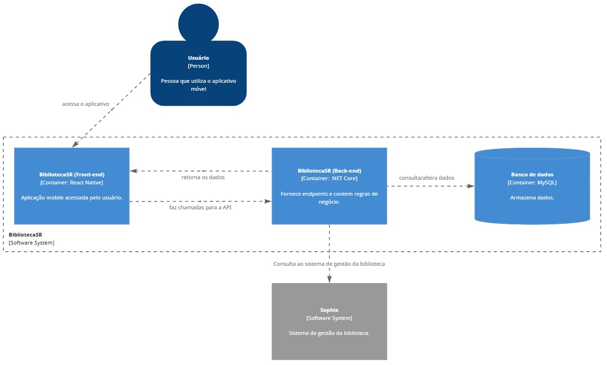
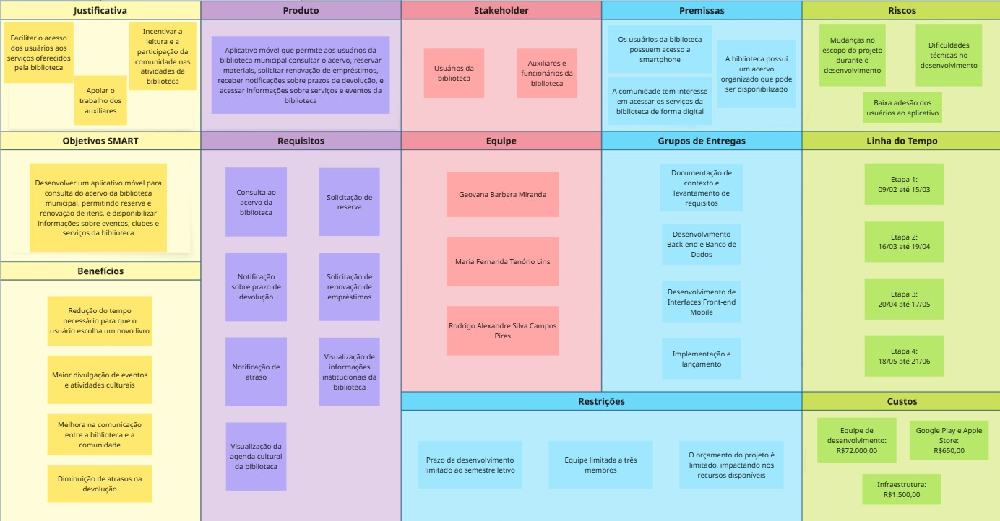

# Especificações do Projeto

Através de pesquisas de campo dentro do público alvo do projeto, foram estipuladas as personas que seguem juntamente de suas histórias de usuário, dando origem aos requisitos funcionais e não funcionais da aplicação.

# Personas

# 

# 

# 

# 

# 

## Histórias de Usuários

A partir da compreensão do dia a dia das personas identificadas para o projeto, foram registradas as seguintes histórias de usuários.

| EU COMO... `PERSONA` | QUERO/PRECISO ... `FUNCIONALIDADE` | PARA ... `MOTIVO/VALOR` |
|----------------------|------------------------------------|--------------------------|
| Lucas Ferreira | Pesquisar livros pelo título ou autor no aplicativo da biblioteca. | Saber se a biblioteca possui o livro que estou procurando sem precisar ir até o local. |
| Lucas Ferreira | Ver se um livro está disponível ou emprestado. | Decidir se posso ir até a biblioteca retirar o livro ou se preciso reservá-lo. |
| Lucas Ferreira | Descobrir livros populares ou recomendados. | Encontrar livros que estão em alta nas redes sociais e que eu gostaria de ler. |
| Juliana Martins | Consultar o acervo da biblioteca pelo celular. | Economizar tempo e verificar se existem livros infantis disponíveis para minha filha. |
| Juliana Martins | Reservar livros online antes de ir até a biblioteca. | Ir até a biblioteca apenas para retirar o livro reservado. |
| Juliana Martins | Visualizar livros por categoria infantil. | Encontrar facilmente livros adequados para a idade da minha filha. |
| Aparecida Santos | Receber notificações quando a data de devolução estiver próxima. | Evitar atrasos e multas na devolução dos livros emprestados. |
| Aparecida Santos | Renovar empréstimos diretamente pelo aplicativo. | Não precisar ir até a biblioteca apenas para renovar o prazo do livro. |
| Aparecida Santos | Visualizar os livros que estão atualmente emprestados para mim. | Controlar melhor minhas leituras e datas de devolução. |
| Rafael Oliveira | Consultar os quadrinhos disponíveis na gibiteca da biblioteca. | Saber quais HQs estão disponíveis para leitura ou empréstimo. |
| Rafael Oliveira | Acessar a agenda de clubes e eventos da biblioteca. | Não perder encontros do clube de xadrez, jogos ou outros eventos culturais. |
| Rafael Oliveira | Receber notificações sobre eventos e atividades da biblioteca. | Ser informado sobre novos encontros, campeonatos ou atividades culturais. |
| Camila Rodrigues | Pesquisar livros acadêmicos pelo título ou autor. | Saber se a biblioteca possui os livros indicados pelos professores. |
| Camila Rodrigues | Reservar livros que estejam emprestados. | Garantir que poderei retirar o livro quando ele for devolvido. |
| Camila Rodrigues | Receber uma notificação quando o livro reservado estiver disponível. | Ir até a biblioteca no momento certo para retirar o livro. |

## Arquitetura e Tecnologias

O sistema segue uma arquitetura **cliente-servidor**, onde o aplicativo móvel ou web funciona como cliente, responsável pela interação com o usuário, enquanto o servidor gerencia os dados do sistema, incluindo o acervo da biblioteca, reservas, empréstimos e eventos.

As principais tecnologias previstas para o desenvolvimento incluem:

- **Frontend:** Aplicação web ou mobile para consulta ao acervo, reservas e gerenciamento de empréstimos.
- **Backend:** API responsável pelo gerenciamento de usuários, livros, reservas e eventos.
- **Banco de Dados:** Sistema responsável por armazenar informações do acervo, usuários, empréstimos e reservas.
- **Notificações:** Sistema de alertas para avisar sobre prazos de devolução, disponibilidade de livros e eventos da biblioteca.

Pré-requisitos: <a href="1-Documentação de Contexto.md"> Documentação de Contexto</a>

Definição do problema e ideia de solução a partir da perspectiva do usuário. É composta pela definição do  diagrama de personas, histórias de usuários, requisitos funcionais e não funcionais além das restrições do projeto.

Apresente uma visão geral do que será abordado nesta parte do documento, enumerando as técnicas e/ou ferramentas utilizadas para realizar a especificações do projeto

## Arquitetura e Tecnologias

O projeto será desenvolvido utilizando a arquitetura no modelo cliente-servidor, organizada em camadas, com separação entre frontend, backend e banco de dados.

As tecnologias que serão utilizadas no desenvolvimento da aplicação são:

* Frontend – React Native
* Backend – ASP.NET Core
* Banco de dados – MySQL

 

## Project Model Canvas

## Requisitos

As tabelas que se seguem apresentam os requisitos funcionais e não funcionais que detalham o escopo do projeto. Para determinar a prioridade de requisitos, aplicar uma técnica de priorização de requisitos e detalhar como a técnica foi aplicada.

### Requisitos Funcionais

|ID    | Descrição do Requisito  | Prioridade |
|------|-----------------------------------------|----|
|RF-001| O sistema deve permitir que o usuário faça login | ALTA | 
|RF-002| O sistema deve permitir que o usuário pesquise por um item | ALTA |
|RF-003| O sistema deve permitir que o usuário solicite a reserva de um item | ALTA | 
|RF-004| O sistema deve notificar o usuário quando a data de devolução estiver próxima | ALTA |
|RF-005| O sistema deve notificar o usuário quando a reserva estiver disponível para retirada | ALTA | 
|RF-006| O sistema deve permitir que o usuário consulte a agenda de clubes da biblioteca | ALTA |
|RF-007| O sistema deve notificar o usuário quando a seu empréstimo estiver atrasado | ALTA | 
|RF-008| O sistema deve permitir que o usuário consulte o status do seu cadastro | ALTA |
|RF-009| O sistema deve permitir que o usuário visualize seu histórico de emprétimos | ALTA |

### Requisitos não Funcionais

|ID     | Descrição do Requisito  |Prioridade |
|-------|-------------------------|----|
|RNF-001| O sistema deve ser responsivo para rodar em um dispositivos móvel | MÉDIA | 
|RNF-002| Deve processar requisições do usuário em no máximo 3s |  BAIXA | 
|RNF-003| A interface deve ser simples e intuitiva |  MÉDIA | 
|RNF-004| O sistema deverá ser compatívem com sistemas operacionais Android e IOS |  MÉDIA | 

## Restrições

O projeto está restrito pelos itens apresentados na tabela a seguir.

|ID| Restrição                                             |
|--|-------------------------------------------------------|
|01| O projeto deverá ser entregue até o final do semestre |
|02| 	A equipe não pode subcontratar o desenvolvimento do trabalho.        |

## Diagrama de Casos de Uso

O diagrama de casos de uso é o próximo passo após a elicitação de requisitos, que utiliza um modelo gráfico e uma tabela com as descrições sucintas dos casos de uso e dos atores. Ele contempla a fronteira do sistema e o detalhamento dos requisitos funcionais com a indicação dos atores, casos de uso e seus relacionamentos. 

As referências abaixo irão auxiliá-lo na geração do artefato “Diagrama de Casos de Uso”.

> **Links Úteis**:
> - [Criando Casos de Uso](https://www.ibm.com/docs/pt-br/elm/6.0?topic=requirements-creating-use-cases)
> - [Como Criar Diagrama de Caso de Uso: Tutorial Passo a Passo](https://gitmind.com/pt/fazer-diagrama-de-caso-uso.html/)
> - [Lucidchart](https://www.lucidchart.com/)
> - [Astah](https://astah.net/)
> - [Diagrams](https://app.diagrams.net/)

## Modelo ER (Projeto Conceitual)

O Modelo ER representa através de um diagrama como as entidades (coisas, objetos) se relacionam entre si na aplicação interativa.

Sugestão de ferramentas para geração deste artefato: LucidChart e Draw.io.

A referência abaixo irá auxiliá-lo na geração do artefato “Modelo ER”.

> - [Como fazer um diagrama entidade relacionamento | Lucidchart](https://www.lucidchart.com/pages/pt/como-fazer-um-diagrama-entidade-relacionamento)

## Projeto da Base de Dados

O projeto da base de dados corresponde à representação das entidades e relacionamentos identificadas no Modelo ER, no formato de tabelas, com colunas e chaves primárias/estrangeiras necessárias para representar corretamente as restrições de integridade.
