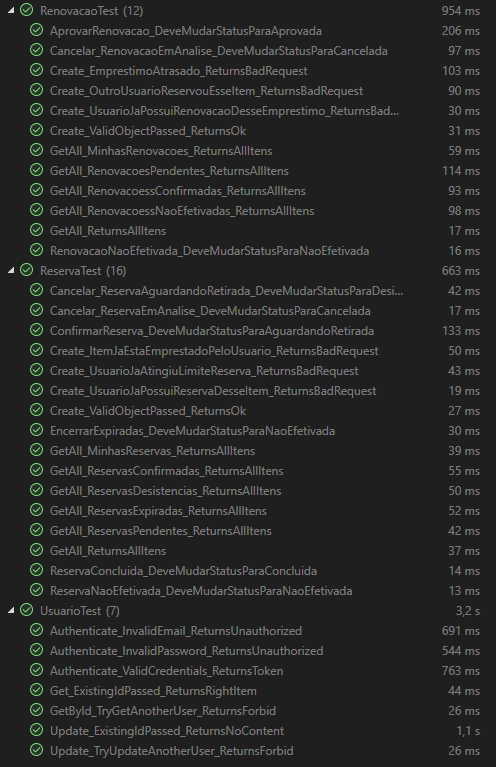
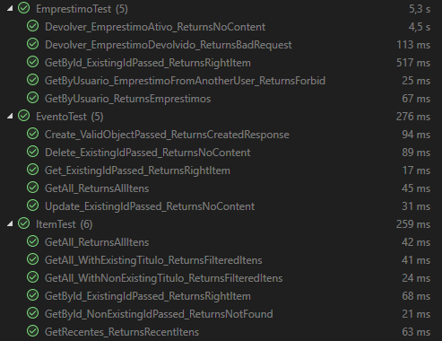
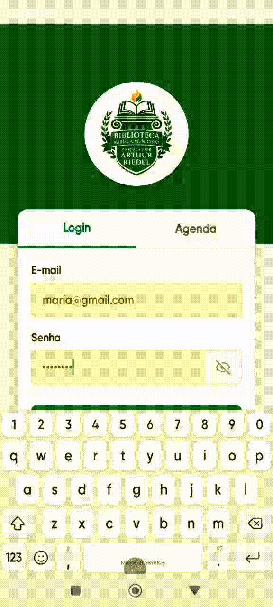

# Testes Unitários

Esta seção apresenta os testes unitários realizados durante o desenvolvimento da aplicação. Ao todo, foram implementados 51 testes com o objetivo de validar o funcionamento de métodos e funcionalidades do sistema, verificando se os resultados obtidos estavam de acordo com o esperado.

# Planos de Testes de Software

Os cenários de teste apresentados nesta seção têm como objetivo verificar o funcionamento das principais funcionalidades do aplicativo. Esses testes foram elaborados com base nos requisitos funcionais definidos durante a etapa de levantamento e análise do projeto.

## Cenários de Testes

| **Caso de Teste** 	| **CT01 – Fazer login** 	|
|:---:	|:---:	|
|	Requisito Associado 	| RF-001	O sistema deve permitir que o usuário faça login |
| Objetivo do Teste 	| Verificar se o sistema permite que o usuário realize o login com credenciais válidas  |
| Passos 	| - Acessar o aplicativo   - Inserir o email   - Inserir a senha   - Clicar em "Entrar"   |
|Critério de Êxito | - O sistema deve autenticar o usuário   - O sistema deve redirecionar o usuário para a página inicial do aplicativo |
|  	|  	|
| **Caso de Teste** 	| **CT02 – Pesquisar item** 	|
|	Requisito Associado 	| RF-002	O sistema deve permitir que o usuário pesquise por um item |
| Objetivo do Teste 	| Verificar se o sistema realiza corretamente a pesquisa de itens a partir de um termo informado pelo usuário, exibindo os resultados correspondentes |
| Passos 	| - Fazer login   - Digitar um termo no campo de busca   - Apertar a tecla de "enter"   |
|Critério de Êxito | - O sistema deve redirecionar para a página "Resultados da busca"   - O sistema deve exibir os itens relacionados ao termo pesquisado |
|  	|  	|
| **Caso de Teste** 	| **CT03 – Vizualizar item** 	|
|	Requisito Associado 	| RF-003	O sistema deve permitir que o usuário visualize as informações de um item |
| Objetivo do Teste 	| Verificar se o sistema apresenta corretamente as informações do item selecionado pelo usuário |
| Passos 	| - Fazer login   - Selecionar um item da listagem ou dos resultados de busca   |
|Critério de Êxito | - O sistema deve redirecionar o usuário para a página de destalhes do item.   - O sistema deve exibir corretamente as informações do item selecionado |
|  	|  	|
| **Caso de Teste** 	| **CT04 – Solicitação de reserva** 	|
|	Requisito Associado 	| RF-004	O sistema deve permitir que o usuário solicite a reserva de um item |
| Objetivo do Teste 	| Verificar se o sistema permite que o usuário solicite a reserva de um item disponível |
| Passos 	| - Fazer login   - Selecionar um item da listagem ou dos resultados de busca   - Clicar em "Solicitar reserva" |
|Critério de Êxito | - O sistema deve registrar a solicitação de reserva   - O sistema deve exibir uma mensagem informando que a reserva foi solicitada e está em análise |
|  	|  	|
| **Caso de Teste** 	| **CT05 – Solicitação de renovação de empréstimo** 	|
|	Requisito Associado 	| RF-005	O sistema deve permitir que o usuário solicite a renovação de um empréstimo |
| Objetivo do Teste 	| Verificar se o sistema permite que o usuário solicite a renovação de um empréstimo ativo |
| Passos 	| - Fazer login   - Acessar a área do usuário   - Clicar em "Empréstimos"   - Selecionar um empréstimo   - Clicar em "Renovar" |
|Critério de Êxito | - O sistema deve registrar a solicitação de renovação   - O sistema deve exibir uma mensagem informando que a renovação foi solicitada e está em análise |
|  	|  	|
| **Caso de Teste** 	| **CT06 – Notificação de devolução próxima** 	|
|	Requisito Associado 	| RF-006	O sistema deve notificar o usuário quando a data de devolução estiver próxima |
| Objetivo do Teste 	| Verificar se o sistema notifica o usuário quando a data de devolução de um empréstimo estiver próxima do vencimento |
| Passos 	| - Fazer login   |
|Critério de Êxito | - O sistema deve exibir uma mensagem na página inicial informando que a data de devolução do empréstimo está próxima |
|  	|  	|
| **Caso de Teste** 	| **CT07 – Notificação de reserva disponível** 	|
|	Requisito Associado 	| RF-007	O sistema deve notificar o usuário quando a reserva estiver disponível para retirada |
| Objetivo do Teste 	| Verificar se o sistema notifica o usuário quando um item reservado estiver disponível para retirada |
| Passos 	| - Fazer login   |
|Critério de Êxito | - O sistema deve exibir uma mensagem na página inicial informando que o item reservado está disponível para retirada |
|  	|  	|
| **Caso de Teste** 	| **CT08 – Consultar agenda de clubes** 	|
|	Requisito Associado 	| RF-008	O sistema deve permitir que o usuário consulte a agenda de clubes da biblioteca |
| Objetivo do Teste 	| Verificar se o sistema exibe corretamente a agenda de clubes da biblioteca |
| Passos 	| - Acessar a área de “Agenda” |
|Critério de Êxito | - O sistema deve exibir uma lista com os clubes da biblioteca   - O sistema deve apresentar informações relacionadas aos clubes, como nome, data e horário |
|  	|  	|
| **Caso de Teste** 	| **CT09 – Notificação de empréstimo atrasado** 	|
|	Requisito Associado 	| RF-009	O sistema deve notificar o usuário quando o seu empréstimo estiver atrasado |
| Objetivo do Teste 	| Verificar se o sistema notifica o usuário quando existir um empréstimo em atraso |
| Passos 	| - Fazer login   |
|Critério de Êxito | 	- O sistema deve exibir uma mensagem na página inicial informando que o usuário possui um empréstimo em atraso |
|  	|  	|
| **Caso de Teste** 	| **CT10 – Consultar status do cadastro** 	|
|	Requisito Associado 	| RF-010	O sistema deve permitir que o usuário consulte o status do seu cadastro |
| Objetivo do Teste 	| Verificar se o sistema permite que o usuário visualize corretamente a situação do seu cadastro |
| Passos 	| - Fazer login   - Acessar a área do usuário   |
|Critério de Êxito | - O sistema deve exibir a situação atual do cadastro do usuário |
 |  	|  	|
| **Caso de Teste** 	| **CT11 – Visuaizar histórico de empréstimos** 	|
|	Requisito Associado 	| RF-011	O sistema deve permitir que o usuário visualize seu histórico de empréstimos |
| Objetivo do Teste 	| Verificar se o sistema permite que o usuário visualize o histórico de seus empréstimos realizados |
| Passos 	| - Fazer login   - Acessar a área do usuário   - Clicar em "Empréstimos"   - Rolar a página até a seção de "Histórico" |
|Critério de Êxito | - O sistema deve exibir as informações do histórico de empréstimos do usuário |

# Evidências de Testes de Software

<table>
  <tr>
    <th colspan="6" width="1000">CT01 – Fazer login</th>
  </tr>
  <tr>
    <td width="170"><strong>Critérios de êxito</strong></td>
    <td colspan="5">O sistema deve permitir que o usuário faça login</td>
  </tr>
  <tr>
    <td><strong>Responsável pelo teste</strong></td>
    <td width="380">Rodrigo</td>
    <td width="150"><strong>Data do Teste</strong></td>
    <td width="150">14/05/2026</td>
  </tr>
  <tr>
    <td width="170"><strong>Comentário</strong></td>
    <td colspan="5"> xxxxxxxxxxxxxxxxx .</td>
  </tr>
  <tr>
    <td colspan="6" align="center"><strong>Evidência</strong></td>
  </tr>
  <tr>
    <td colspan="6" align="center"> </td>
  </tr>
</table>

<table>
  <tr>
    <th colspan="6" width="1000">CT02 – Pesquisar item</th>
  </tr>
  <tr>
    <td width="170"><strong>Critérios de êxito</strong></td>
    <td colspan="5">O sistema deve permitir que o usuário pesquise por um item</td>
  </tr>
  <tr>
    <td><strong>Responsável pelo teste</strong></td>
    <td width="380">Rodrigo</td>
    <td width="150"><strong>Data do Teste</strong></td>
    <td width="150">14/05/2026</td>
  </tr>
  <tr>
    <td width="170"><strong>Comentário</strong></td>
    <td colspan="5"> xxxxxxxxxxxxxxxxx .</td>
  </tr>
  <tr>
    <td colspan="6" align="center"><strong>Evidência</strong></td>
  </tr>
  <tr>
    <td colspan="6" align="center"> </td>
  </tr>
</table>
<table>
  <tr>
    <th colspan="6" width="1000">CT03 – Vizualizar item</th>
  </tr>
  <tr>
    <td width="170"><strong>Critérios de êxito</strong></td>
    <td colspan="5">O sistema deve permitir que o usuário visualize as informações de um item</td>
  </tr>
  <tr>
    <td><strong>Responsável pelo teste</strong></td>
    <td width="380">Rodrigo</td>
    <td width="150"><strong>Data do Teste</strong></td>
    <td width="150">14/05/2026</td>
  </tr>
  <tr>
    <td width="170"><strong>Comentário</strong></td>
    <td colspan="5"> xxxxxxxxxxxxxxxxx .</td>
  </tr>
  <tr>
    <td colspan="6" align="center"><strong>Evidência</strong></td>
  </tr>
  <tr>
    <td colspan="6" align="center"> </td>
  </tr>
</table>
<table>
  <tr>
    <th colspan="6" width="1000">CT04 – Solicitação de reserva</th>
  </tr>
  <tr>
    <td width="170"><strong>Critérios de êxito</strong></td>
    <td colspan="5">O sistema deve permitir que o usuário solicite a reserva de um item</td>
  </tr>
  <tr>
    <td><strong>Responsável pelo teste</strong></td>
    <td width="380">Rodrigo</td>
    <td width="150"><strong>Data do Teste</strong></td>
    <td width="150">14/05/2026</td>
  </tr>
  <tr>
    <td width="170"><strong>Comentário</strong></td>
    <td colspan="5"> xxxxxxxxxxxxxxxxx .</td>
  </tr>
  <tr>
    <td colspan="6" align="center"><strong>Evidência</strong></td>
  </tr>
  <tr>
    <td colspan="6" align="center"> </td>
  </tr>
</table>
<table>
  <tr>
    <th colspan="6" width="1000">CT05 – Solicitação de renovação de empréstimo</th>
  </tr>
  <tr>
    <td width="170"><strong>Critérios de êxito</strong></td>
    <td colspan="5">O sistema deve permitir que o usuário solicite a renovação de um empréstimo</td>
  </tr>
  <tr>
    <td><strong>Responsável pelo teste</strong></td>
    <td width="380">Rodrigo</td>
    <td width="150"><strong>Data do Teste</strong></td>
    <td width="150">14/05/2026</td>
  </tr>
  <tr>
    <td width="170"><strong>Comentário</strong></td>
    <td colspan="5"> xxxxxxxxxxxxxxxxx .</td>
  </tr>
  <tr>
    <td colspan="6" align="center"><strong>Evidência</strong></td>
  </tr>
  <tr>
    <td colspan="6" align="center"> </td>
  </tr>
</table>
<table>
  <tr>
    <th colspan="6" width="1000">CT06 – Notificação de devolução próxima</th>
  </tr>
  <tr>
    <td width="170"><strong>Critérios de êxito</strong></td>
    <td colspan="5">O sistema deve notificar o usuário quando a data de devolução estiver próxima</td>
  </tr>
  <tr>
    <td><strong>Responsável pelo teste</strong></td>
    <td width="380">Rodrigo</td>
    <td width="150"><strong>Data do Teste</strong></td>
    <td width="150">14/05/2026</td>
  </tr>
  <tr>
    <td width="170"><strong>Comentário</strong></td>
    <td colspan="5"> xxxxxxxxxxxxxxxxx .</td>
  </tr>
  <tr>
    <td colspan="6" align="center"><strong>Evidência</strong></td>
  </tr>
  <tr>
    <td colspan="6" align="center"> </td>
  </tr>
</table>
<table>
  <tr>
    <th colspan="6" width="1000">CT07 - Notificação de reserva disponível</th>
  </tr>
  <tr>
    <td width="170"><strong>Critérios de êxito</strong></td>
    <td colspan="5">O sistema deve exibir uma mensagem na página inicial informando que o item reservado está disponível para retirada</td>
  </tr>
  <tr>
    <td><strong>Responsável pelo teste</strong></td>
    <td width="380">Maria</td>
    <td width="150"><strong>Data do Teste</strong></td>
    <td width="150">14/05/2026</td>
  </tr>
  <tr>
    <td width="170"><strong>Comentário</strong></td>
    <td colspan="5">O usuário foi notificado com sucesso.</td>
  </tr>
  <tr>
    <td colspan="6" align="center"><strong>Evidência</strong></td>
  </tr>
  <tr>
    <td colspan="6" align="center"> </td>
  </tr>
</table>
<table>
  <tr>
    <th colspan="6" width="1000">CT08 – Consultar agenda de clubes</th>
  </tr>
  <tr>
    <td width="170"><strong>Critérios de êxito</strong></td>
    <td colspan="5">O sistema deve permitir que o usuário consulte a agenda de clubes da biblioteca</td>
  </tr>
  <tr>
    <td><strong>Responsável pelo teste</strong></td>
    <td width="380">Maria</td>
    <td width="150"><strong>Data do Teste</strong></td>
    <td width="150">14/05/2026</td>
  </tr>
  <tr>
    <td width="170"><strong>Comentário</strong></td>
    <td colspan="5">xxxxxxxxxxxxxxxxxxxxxxxx .</td>
  </tr>
  <tr>
    <td colspan="6" align="center"><strong>Evidência</strong></td>
  </tr>
  <tr>
    <td colspan="6" align="center"> </td>
  </tr>
</table>
<table>
  <tr>
    <th colspan="6" width="1000">CT09 – Notificação de empréstimo atrasado</th>
  </tr>
  <tr>
    <td width="170"><strong>Critérios de êxito</strong></td>
    <td colspan="5">O sistema deve notificar o usuário quando o seu empréstimo estiver atrasado</td>
  </tr>
  <tr>
    <td><strong>Responsável pelo teste</strong></td>
    <td width="380">Maria</td>
    <td width="150"><strong>Data do Teste</strong></td>
    <td width="150">14/05/2026</td>
  </tr>
  <tr>
    <td width="170"><strong>Comentário</strong></td>
    <td colspan="5">xxxxxxxxxxxxxxxxxxxxxxxx .</td>
  </tr>
  <tr>
    <td colspan="6" align="center"><strong>Evidência</strong></td>
  </tr>
  <tr>
    <td colspan="6" align="center"> </td>
  </tr>
</table>
<table>
  <tr>
    <th colspan="6" width="1000">CT10 – Consultar status do cadastro</th>
  </tr>
  <tr>
    <td width="170"><strong>Critérios de êxito</strong></td>
    <td colspan="5">O sistema deve permitir que o usuário consulte o status do seu cadastro</td>
  </tr>
  <tr>
    <td><strong>Responsável pelo teste</strong></td>
    <td width="380">Maria</td>
    <td width="150"><strong>Data do Teste</strong></td>
    <td width="150">14/05/2026</td>
  </tr>
  <tr>
    <td width="170"><strong>Comentário</strong></td>
    <td colspan="5">xxxxxxxxxxxxxxxxxxxxxxxx .</td>
  </tr>
  <tr>
    <td colspan="6" align="center"><strong>Evidência</strong></td>
  </tr>
  <tr>
    <td colspan="6" align="center"> </td>
  </tr>
</table>
<table>
  <tr>
    <th colspan="6" width="1000">CT11 – Visuaizar histórico de empréstimos</th>
  </tr>
  <tr>
    <td width="170"><strong>Critérios de êxito</strong></td>
    <td colspan="5">O sistema deve permitir que o usuário visualize seu histórico de empréstimos</td>
  </tr>
  <tr>
    <td><strong>Responsável pelo teste</strong></td>
    <td width="380">Maria</td>
    <td width="150"><strong>Data do Teste</strong></td>
    <td width="150">14/05/2026</td>
  </tr>
  <tr>
    <td width="170"><strong>Comentário</strong></td>
    <td colspan="5">xxxxxxxxxxxxxxxxxxxxxxxx .</td>
  </tr>
  <tr>
    <td colspan="6" align="center"><strong>Evidência</strong></td>
  </tr>
  <tr>
    <td colspan="6" align="center"> </td>
  </tr>
</table>

Apresente imagens e/ou vídeos que comprovam que um determinado teste foi executado, e o resultado esperado foi obtido. Normalmente são screenshots de telas, ou vídeos do software em funcionamento.
